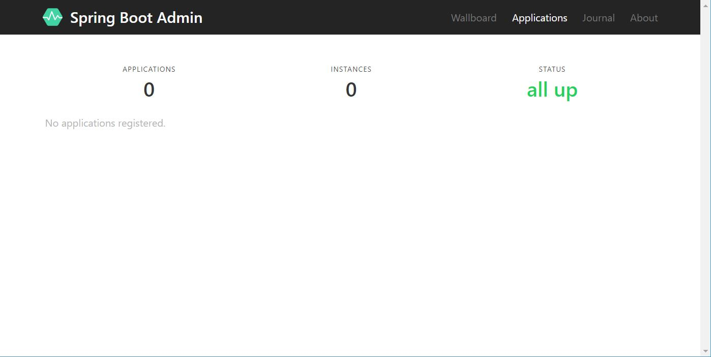

# SpringBootAdmin服务监控页面

Spring Boot Admin 用于监控基于 Spring Boot 的应用，它是在 Spring Boot Actuator 的基础上提供简洁的可视化 WEB UI。

## 服务端

添加相关依赖

```
<!--spring-boot-admin服务端-->
<dependency>
	<groupId>de.codecentric</groupId>
	<artifactId>spring-boot-admin-server</artifactId>
	<version>2.0.5</version>
</dependency>
<dependency>
	<groupId>de.codecentric</groupId>
	<artifactId>spring-boot-admin-server-ui</artifactId>
	<version>2.0.5</version>
</dependency>
```

启动类添加注解，开启监控

```
@SpringBootApplication
@EnableAdminServer
public class SpringBootAdminServerApplication {

    public static void main(String[] args) {
        SpringApplication.run(SpringBootAdminServerApplication.class, args);
    }

}
```

配置文件

```
server:
  port: 9310
spring:
  application:
    name: spring-boot-admin-server
```



## 客户端

添加相关依赖

```
<!--spring-boot-admin客户端-->
<dependency>
	<groupId>de.codecentric</groupId>
	<artifactId>spring-boot-admin-starter-client</artifactId>
	<version>2.0.5</version>
</dependency>
```

配置文件

```
server:
  port: 9311
spring:
  application:
    name: spring-boot-admin-client
  boot:
    admin:
      client:
        url: http://localhost:9310
management:
  endpoints:
    web:
      exposure:
        include: "*"
  endpoint:
    health:
      show-details: ALWAYS
```

以上的配置，就可以实现 Spring Boot 项目中 Spring Boot Admin 监控其他应用了


# Spring Boot Admin 和 Eureka

在 Spring Cloud 中使用 Spring Boot Admin 监控 Spring Cloud 的服务，下面我们就详细的讲解在 Spring Cloud 中搭建 Spring Boot Admin

## 基于 Eureka 的 Spring Boot Admin 的搭建
。。。


